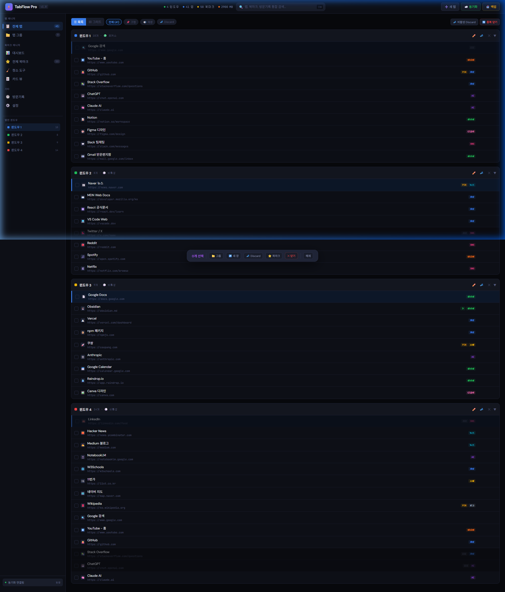
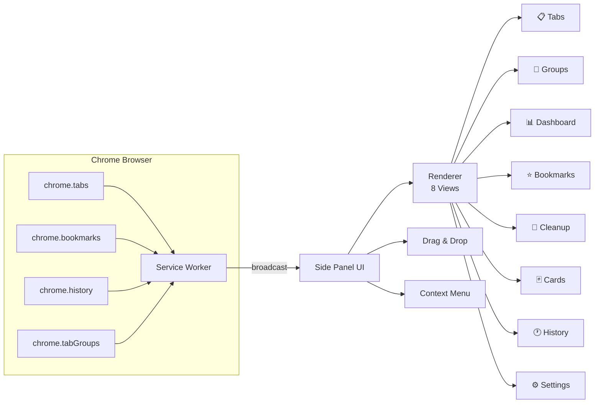
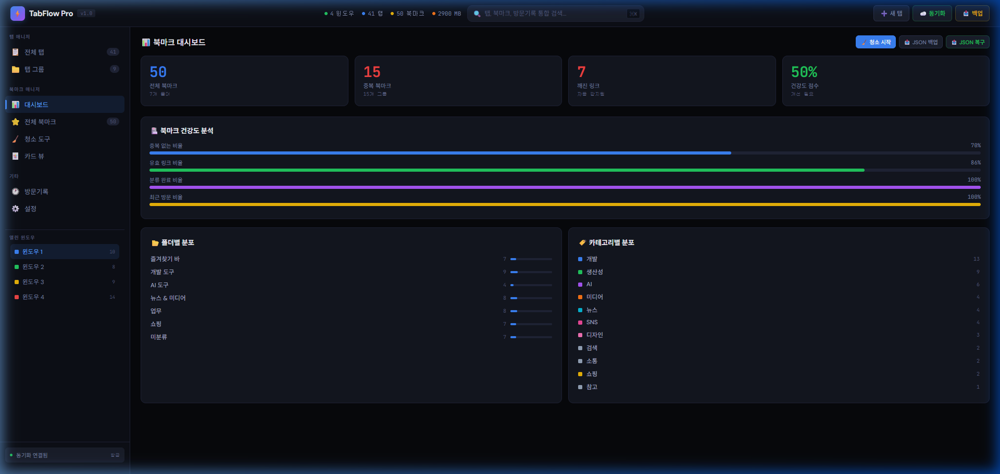
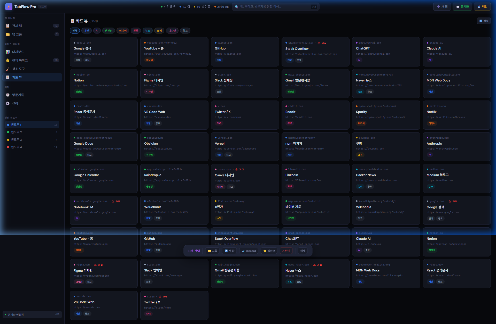

<div align="center">

# ⚡ Moon-TabFlow

### *탭과 북마크를 하나의 사이드 패널에서*

**Chrome Extension (Manifest V3) — 탭 관리, 북마크 청소, AI 자동 분류, 동기화를 하나로**

[](https://github.com/Reasonofmoon/tabflow)
[](https://github.com/Reasonofmoon/tabflow)
[](https://developer.chrome.com/docs/extensions/mv3/)
[](LICENSE)
[](https://github.com/Reasonofmoon/tabflow)

> **"탭 50개가 열린 브라우저에서 원하는 페이지를 찾는 데 30초가 걸린다면,**
> **그건 더 이상 생산성 도구가 아니라 생산성의 적이다."**
>
> Moon-TabFlow는 흩어진 탭과 북마크를 구조화하고, AI 키워드 분류로 정리하며,
> 깨진 링크와 중복을 자동 감지하여 브라우저를 다시 빠르게 만든다.

[🐛 이슈 리포트](../../issues) · [📋 프로젝트](../../projects)

</div>

---



---

## 🧠 Philosophy — "왜 만들었는가"

탭 매니저와 북마크 매니저는 왜 항상 **따로** 있는가?
수십 개의 탭을 열어놓고 "나중에 볼 것"을 북마크에 저장하고, 다시 그 북마크를 찾지 못하는 악순환.

| 기준 | 기존 방식 | Moon-TabFlow |
|------|-----------|-------------|
| 탭 + 북마크 | 별도 창/확장 2개 | **통합 사이드 패널** |
| 중복 정리 | 수동 검색 | **1-Click 자동 감지** |
| 깨진 링크 | 모름 → 방치 | **HEAD 요청으로 자동 감지** |
| 분류 | 수동 폴더 이동 | **AI 키워드 자동 분류** |
| 탭 순서 변경 | 탭 바에서 드래그 | **드래그앤드롭 + 윈도우 간 이동** |
| 메모리 관리 | Chrome 내장 | **1-Click Discard + 예상 절약량 표시** |



---

## ⚙️ System Layers

### Layer 1 · API Wrappers

Chrome API를 깔끔한 `async/await` 함수로 감싸는 6개 모듈.

| Module | Chrome API | Key Functions |
|--------|-----------|---------------|
| `tabs.js` | `chrome.tabs` | getAllTabsByWindow, closeTab, discardTab, togglePin, moveTab |
| `bookmarks.js` | `chrome.bookmarks` | getAllBookmarks, addBookmark, removeBookmark, searchBookmarks |
| `windows.js` | `chrome.windows` | getAllWindows, createWindow, focusWindow |
| `groups.js` | `chrome.tabGroups` | createGroup, autoGroupByKeywords |
| `history.js` | `chrome.history` | searchHistory, getVisits |
| `storage.js` | `chrome.storage` | getSettings, saveSettings, exportBackup |

### Layer 2 · Core Logic

> **Wow**: 1,000개 북마크의 중복/깨진 링크/건강도를 **3초** 만에 분석

| Module | Purpose |
|--------|---------|
| `state.js` | 중앙 상태 관리 (view, filter, selection, data) |
| `classifier.js` | 9개 카테고리 × 키워드 매칭 → 자동 폴더 분류 |
| `health-checker.js` | URL 정규화 → 중복 그룹, 빈 폴더, 건강 점수 |
| `link-checker.js` | HEAD 요청 + 타임아웃 + 배치 처리 (3 concurrent) |

### Layer 3 · UI Rendering

> **Wow**: 모든 8개 뷰를 **단일 렌더러**가 state-driven으로 관리

| Component | Role |
|-----------|------|
| `renderer.js` | 8개 뷰의 HTML 생성 (data-action 기반 이벤트 위임) |
| `drag-drop.js` | 탭 드래그앤드롭 → `chrome.tabs.move()` |
| `context-menu.js` | 우클릭 메뉴 (이동, 복제, 고정, 전용창, 북마크 추가) |
| `toast.js` | 알림 토스트 (XSS 안전한 HTML 이스케이프) |

---



---

## 🎯 수준별 활용 가이드

### 🟢 Starter — "2분 안에 설치 → 탭 정리"

1. `chrome://extensions` → Developer Mode → **Load unpacked**
2. 이 저장소의 `tabflow-pro/` 폴더 선택
3. 툴바의 ⚡ 아이콘 클릭 → **사이드 패널 열기**
4. 💤 **비활성 Discard** 버튼으로 메모리 즉시 절약

### 🔵 Professional — "북마크 청소 + 자동 분류"

1. 📊 **대시보드** → 건강도 점수 확인
2. 🧹 **청소 도구** → 중복 제거 → 깨진 링크 삭제
3. 🤖 **AI 자동 분류** → 개발/AI/SNS/미디어 등 9개 카테고리 폴더 자동 생성
4. 📥 **JSON 백업** → 언제든 복구 가능

### 🟣 Power User — "키보드 + 그룹 + 동기화"

1. `Ctrl+Shift+K` → 통합 검색 (탭 + 북마크 + 방문기록)
2. `Ctrl+Shift+D` → 비활성 탭 일괄 Discard
3. `Ctrl+Click` 다중 선택 → 📁 그룹 생성 / ↗️ 새 창 이동
4. 우클릭 컨텍스트 메뉴로 개별 탭 세밀 조작
5. ☁️ `chrome.storage.sync` 설정 동기화

---



---

## 🔧 확장 & 커스터마이징

| 우선순위 | 방법 | 난이도 | 범위 |
|----------|------|--------|------|
| **1st** | `state.js`의 `CATS` 배열에 분류 규칙 추가 | ⭐ | 분류 |
| **2nd** | `renderer.js`에 새 뷰 함수 추가 + `renderMain` 라우팅 | ⭐⭐ | UI |
| **3rd** | `service-worker.js`에 새 이벤트 리스너 추가 | ⭐⭐ | 자동화 |
| **4th** | API 래퍼 + 코어 모듈 확장 | ⭐⭐⭐ | 전체 |

---

## 📁 Project Structure

```
tabflow-pro/
├── manifest.json                 # Manifest V3
├── _locales/ko/messages.json     # i18n (한국어)
├── icons/                        # 16/32/48/128px
├── images/                       # README 스크린샷
└── src/
    ├── api/          ← Chrome API 래퍼 (6 modules)
    ├── core/         ← 비즈니스 로직 (4 modules)
    ├── ui/           ← 렌더러 & 컴포넌트 (4 modules)
    ├── utils/        ← URL 파서
    ├── background/   ← Service Worker
    ├── sidepanel/    ← 메인 UI (HTML + CSS + JS)
    ├── popup/        ← 퀵 액션 팝업
    └── options/      ← 설정 페이지
```

---

## 🌐 다국어 / Multilingual

| 항목 | 현황 |
|------|------|
| UI 텍스트 | 🇰🇷 한국어 (기본) |
| 분류 카테고리 | 🇰🇷 한국어 |
| README | 🇰🇷 한국어 + 🇬🇧 English |
| 확장 예정 | `_locales/en/messages.json` 추가 시 영어 지원 |

---

## 🛠️ Tech Stack

| Layer | Technology |
|-------|-----------|
| Platform | Chrome Extension Manifest V3 |
| Language | Vanilla JavaScript (ES Modules) |
| Styling | Vanilla CSS (Dark Industrial Theme) |
| APIs | tabs, tabGroups, bookmarks, history, storage, sidePanel, contextMenus, favicon |
| Architecture | Service Worker + Side Panel + Event Delegation |
| Dependencies | **Zero** — 외부 라이브러리 없음 |

---

<div align="center">

**Built with ⚡ by [Reasonofmoon](https://github.com/Reasonofmoon)**

MIT License

</div>
