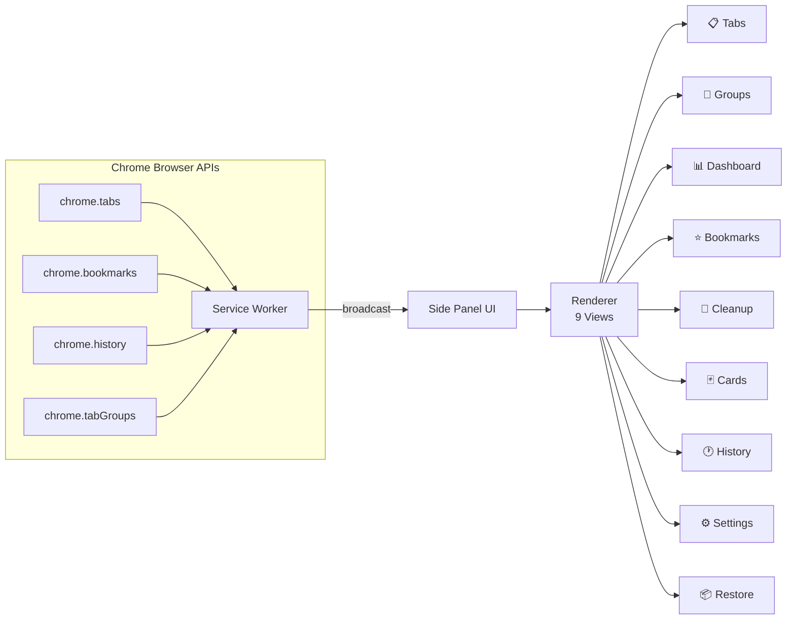

<div align="center">

# ⚡ Moon-TabFlow v2

### *탭과 북마크를 하나의 사이드 패널에서 — 백업 복원 · AI 20개 카테고리 · 폴더 정리*

**Chrome Extension (Manifest V3) — 탭 관리, 북마크 백업·복원, AI 20개 카테고리 자동 분류, 폴더 정리를 하나로**

[](https://chromewebstore.google.com/detail/moon-tabflow)
[](https://chromewebstore.google.com/detail/moon-tabflow)
[](https://developer.chrome.com/docs/extensions/mv3/)
[](LICENSE)
[](https://github.com/Reasonofmoon/tabflow)

> **"탭 50개가 열린 브라우저에서 원하는 페이지를 찾는 데 30초가 걸린다면,**
> **그건 더 이상 생산성 도구가 아니라 생산성의 적이다."**
>
> Moon-TabFlow는 흩어진 탭과 북마크를 구조화하고, AI 20개 카테고리 분류로 정리하며,
> 백업 복원과 폴더 정리 도구로 브라우저를 다시 빠르게 만든다.

[🛒 Chrome Web Store에서 설치](https://chromewebstore.google.com/detail/moon-tabflow) · [🐛 이슈 리포트](../../issues)

</div>

---

## 📸 Screenshots

<!-- 스크린샷: 실제 사이드 패널 UI 캡처를 images/ 폴더에 넣어주세요 -->

| Tab Manager | Bookmark Dashboard | AI Classify |
|:-----------:|:------------------:|:-----------:|
|  |  |  |

---

## 🆕 v2.0 — What's New

| 기능 | Before (v1) | After (v2) |
|------|------------|------------|
| 📦 **백업 복원** | 없음 | JSON에서 URL만 추출하여 플랫 복원 |
| 🤖 **AI 분류** | 9개 카테고리 | **20개** 스마트 카테고리 |
| 🗂️ **폴더 정리** | 없음 | 트리 뷰 + 이름 변경 + 정렬 + 평탄화 + 삭제 |
| 📊 **복원 프로그레스** | 없음 | 실시간 진행률 + 에러 로그 |
| 🏷️ **카테고리 이모지** | 텍스트만 | 📚🤖💻🔬☁️🎨📝🎵 등 시각적 구분 |

---

## 🧠 Philosophy — "왜 만들었는가"

탭 매니저와 북마크 매니저는 왜 항상 **따로** 있는가?

수십 개의 탭을 열어놓고 "나중에 볼 것"을 북마크에 저장하고, 다시 그 북마크를 찾지 못하는 악순환. 도메인별로 자동 정리해주는 도구들은 오히려 862개의 폴더를 만들어 더 혼란스럽게 한다.

| 기준 | 기존 방식 | Moon-TabFlow |
|------|-----------|-------------|
| 탭 + 북마크 | 별도 창/확장 2개 | **통합 사이드 패널** |
| 중복 정리 | 수동 검색 | **1-Click 자동 감지** |
| 깨진 링크 | 모름 → 방치 | **HEAD 요청 자동 감지** |
| 분류 | 도메인별 (862개 폴더!) | **AI 20개 카테고리** |
| 백업 복원 | 없음 / 폴더 재생성 | **플랫 복원 (URL만 추출)** |
| 폴더 정리 | 하나씩 수동 삭제 | **빈 폴더 감지 + 일괄 삭제** |
| 메모리 관리 | Chrome 내장 | **1-Click Discard + 절약량** |



---

## 📖 상세 사용법 — Step by Step

### 📥 Step 1: 설치하기

#### 방법 A: Chrome Web Store (추천)
1. [Chrome Web Store](https://chromewebstore.google.com/detail/moon-tabflow)에서 **"Chrome에 추가"** 클릭
2. 권한 확인 팝업에서 **"확장 프로그램 추가"** 클릭
3. 완료! 툴바에 ⚡ 아이콘이 나타남

#### 방법 B: 개발자 모드 (소스 직접 설치)
1. 이 저장소를 클론:
   ```bash
   git clone https://github.com/Reasonofmoon/tabflow.git
   ```
2. Chrome에서 `chrome://extensions` 입력 → Enter
3. 우측 상단 **"개발자 모드"** 토글 ON
4. **"압축해제된 확장 프로그램을 로드합니다"** 클릭
5. 클론한 `tabflow-pro/` 폴더 선택
6. 완료! ⚡ 아이콘이 툴바에 나타남

---

### 📋 Step 2: 사이드 패널 열기

1. 툴바의 ⚡ **Moon-TabFlow 아이콘** 클릭
2. 또는 아무 페이지에서 **우클릭** → **"Moon-TabFlow 열기"**
3. 사이드 패널이 오른쪽에 나타남

> 💡 **사이드 패널 단축키**: `Ctrl+Shift+T`로 빠르게 토글

---

### 📋 Step 3: 탭 관리하기

사이드바에서 **📋 탭 관리** 메뉴를 선택합니다.

#### 🔍 탭 검색
- 상단 검색창에 키워드를 입력하면 **모든 윈도우의 탭**을 실시간 검색
- 단축키: `Ctrl+Shift+K`

#### 💤 메모리 절약 (Discard)
1. 상단의 **💤 비활성 Discard** 버튼 클릭
2. 현재 보고 있지 않은 모든 탭의 메모리를 해제
3. 탭은 유지되지만 다시 클릭할 때 새로 로드됨
4. 단축키: `Ctrl+Shift+D`

#### 📁 탭 그룹핑
1. `Ctrl+Click`으로 여러 탭 선택 (체크박스)
2. 하단 선택바의 **📁 그룹** 버튼 클릭
3. 그룹 이름과 색상 지정 → 자동 그룹 생성

#### ↔️ 드래그앤드롭
- 탭을 드래그하여 순서 변경
- 다른 윈도우로 이동도 가능

#### 우클릭 메뉴
탭 항목을 **우클릭**하면:
- 📌 고정 / 해제
- 🔇 음소거
- 📋 URL 복사
- ↗️ 새 창으로 이동
- ⭐ 북마크에 추가

---

### ⭐ Step 4: 북마크 관리하기

사이드바에서 **⭐ 북마크** 메뉴를 선택합니다.

#### 📊 대시보드 확인
- **건강도 점수**: 북마크 전체 상태를 0~100점으로 표시
- **중복 감지**: 같은 URL을 가진 북마크 개수
- **깨진 링크**: HEAD 요청으로 접속 불가한 URL 감지

#### 🧹 청소 도구
1. 사이드바 → **🧹 관리 도구** 메뉴
2. **중복 제거**: 같은 URL의 북마크를 하나만 남기고 삭제
3. **깨진 링크 삭제**: 접속 불가한 북마크 삭제
4. **🤖 AI 자동 분류**: 모든 북마크를 20개 카테고리 폴더로 자동 이동

---

### 🤖 Step 5: AI 자동 분류 사용하기

**가장 강력한 v2 기능!** 1,000개 이상의 북마크도 20개 카테고리로 깔끔하게 정리합니다.

#### 사용 방법
1. 사이드바 → **🧹 관리 도구** 메뉴
2. **🤖 AI 자동 분류** 버튼 클릭
3. 자동으로 모든 북마크를 분석하여 카테고리별 폴더로 이동
4. 완료 알림 표시

#### 20개 카테고리 목록

| 카테고리 | 분류 예시 |
|----------|-----------|
| 📚 교육 | Khan Academy, Coursera, ReadWorks, 교육 관련 사이트 |
| 🤖 AI | ChatGPT, Claude, Gemini, HuggingFace, AI 도구 |
| 💻 개발 | GitHub, StackOverflow, MDN, NPM, 개발자 도구 |
| 🔬 연구 | Google Scholar, arXiv, Wikipedia, 연구 논문 |
| ☁️ 클라우드 | Firebase, Vercel, AWS, Google Cloud |
| 🎨 디자인 | Figma, Canva, Lottie, 디자인 리소스 |
| 📝 생산성 | Notion, Obsidian, Google Docs, 일정 관리 |
| 🎵 미디어 | YouTube, Spotify, Suno, 음악/영상 |
| 💬 SNS | Twitter/X, Reddit, LinkedIn, Medium, 블로그 |
| 📰 뉴스 | HackerNews, TechCrunch, 뉴스 사이트 |
| 🛒 쇼핑 | Amazon, Coupang, 쇼핑몰 |
| 📖 도서 | OpenLibrary, Scribd, 도서 관련 |
| 🌐 번역/언어 | DeepL, Papago, 사전/문법 사이트 |
| 🔐 특허/법률 | 특허 검색, 법률 정보 |
| 🎮 인터랙티브 | 게임, 퀴즈, 인터랙티브 도구 |
| 📊 데이터 | 차트, 분석, PDF 변환 도구 |
| 🖼️ 3D/VR | 3D 모델링, VR/AR 콘텐츠 |
| 🔧 유틸리티 | URL 단축, 파일 변환, 유틸리티 |
| 🇰🇷 한국 | .kr 도메인, 네이버, 다음, 카카오 |
| 📦 기타 | 위 카테고리에 해당하지 않는 나머지 |

> 💡 `src/core/state.js`의 `CATS` 배열에서 카테고리와 키워드를 사용자 정의할 수 있습니다.

---

### 📦 Step 6: 백업 & 복원하기

북마크를 JSON 파일로 백업하고, 필요할 때 복원합니다.

#### 백업 만들기
1. 사이드바 → **⚙️ 설정** 메뉴
2. **📥 JSON 백업** 버튼 클릭
3. `tabflow-backup-YYYY-MM-DD.json` 파일이 다운로드됨

#### 복원하기 (v2 플랫 복원)
1. 사이드바 → **📦 복원 & 정리** 메뉴
2. **📂 백업 파일 선택** 클릭 → JSON 파일 선택
3. 미리보기에서 URL 수, 폴더 수, 트리 구조 확인
4. 두 가지 옵션 중 선택:

| 옵션 | 설명 |
|------|------|
| **기존에 추가** | 현재 북마크 유지 + 백업 내용 추가 |
| **🧹 클린 복원** | 현재 북마크 모두 삭제 후 백업에서 복원 |

5. 진행률 바가 실시간으로 표시됨
6. 완료! 모든 URL이 북마크바 아래에 **폴더 없이 플랫하게** 복원됨

> 🔑 **플랫 복원의 장점**: 도메인별 폴더가 생기지 않아 검색이 쉽고, 이후 AI 분류로 깔끔하게 정리할 수 있습니다.

#### 추천 워크플로우
```
① 클린 복원 → ② AI 자동 분류 → ③ 최적의 북마크 정리 완성!
```

---

### 🗂️ Step 7: 폴더 정리하기

사이드바 → **📦 복원 & 정리** → **🗂️ 폴더 정리** 탭

#### 📊 통계 대시보드
- 전체 URL 수, 폴더 수, 빈 폴더 수, 최대 깊이 확인

#### 🗑️ 빈 폴더 일괄 삭제
1. **빈 폴더** 항목 확인 (노란색 🏷️ 표시)
2. **🗑️ 빈 폴더 전체 삭제** 버튼 클릭
3. 한 번에 모든 빈 폴더 정리!

#### ✏️ 폴더 이름 변경
- 폴더 위에 마우스를 올리면 **✏️** 버튼 표시
- 클릭 → 새 이름 입력 → 저장

#### 🔤 폴더 내용 정렬
- 폴더의 **🔤** 버튼 → 하위 항목을 이름순으로 정렬

#### ⬆️ 폴더 평탄화
- 깊은 하위 폴더의 내용을 상위 폴더로 이동
- 복잡한 폴더 구조를 단순하게!

---

### 🃏 Step 8: 카드 뷰 사용하기

사이드바 → **🃏 카드 뷰** 메뉴

- 북마크를 시각적 카드로 표시
- 각 카드에 카테고리 태그 + 파비콘 표시
- 카테고리별 필터링 가능

---

### ⌨️ Step 9: 키보드 단축키

| 단축키 | 기능 |
|--------|------|
| `Ctrl+Shift+T` | 사이드 패널 열기/닫기 |
| `Ctrl+Shift+K` | 통합 검색 (탭 + 북마크 + 방문기록) |
| `Ctrl+Shift+D` | 비활성 탭 일괄 Discard |
| `Ctrl+Click` | 탭 다중 선택 |

---

### 🎨 Step 10: 테마 변경하기

1. 사이드바 → **⚙️ 설정** 메뉴
2. **테마** 설정에서 선택:

| 테마 | 설명 |
|------|------|
| 🌙 **다크** | 어두운 산업적 디자인 (기본값) |
| ☀️ **라이트** | 밝은 테마 |
| 🖥️ **시스템** | OS 설정에 맞춤 자동 전환 |

---

## ⚙️ System Layers

### Layer 1 · API Wrappers

Chrome API를 깔끔한 `async/await` 함수로 감싸는 6개 모듈.

| Module | Chrome API | Key Functions |
|--------|-----------|---------------|
| `tabs.js` | `chrome.tabs` | getAllTabsByWindow, closeTab, discardTab, togglePin |
| `bookmarks.js` | `chrome.bookmarks` | getAllBookmarks, addBookmark, removeBookmark |
| `windows.js` | `chrome.windows` | getAllWindows, createWindow, focusWindow |
| `groups.js` | `chrome.tabGroups` | createGroup, autoGroupByKeywords |
| `history.js` | `chrome.history` | searchHistory, getVisits |
| `storage.js` | `chrome.storage` | getSettings, saveSettings, **importBackup** |

### Layer 2 · Core Logic

> **Wow**: 1,000개 북마크의 중복/깨진 링크/건강도를 **3초** 만에 분석

| Module | Purpose |
|--------|---------|
| `state.js` | 중앙 상태 관리 + **20개 CATS 카테고리 정의** |
| `classifier.js` | **20개 카테고리** × 키워드 매칭 → 자동 분류 |
| `health-checker.js` | URL 정규화 → 중복 그룹, 빈 폴더, 건강 점수 |
| `link-checker.js` | HEAD 요청 + 타임아웃 + 배치 (3 concurrent) |
| `organizer.js` | 트리 탐색, 빈 폴더 감지, 정렬/평탄화/삭제 |

### Layer 3 · UI Rendering

> **Wow**: 모든 9개 뷰를 **단일 렌더러**가 state-driven으로 관리

| Component | Role |
|-----------|------|
| `renderer.js` | 9개 뷰의 HTML 생성 (data-action 이벤트 위임) |
| `drag-drop.js` | 탭 드래그앤드롭 → `chrome.tabs.move()` |
| `context-menu.js` | 우클릭 메뉴 (이동, 복제, 고정, 북마크 추가) |
| `toast.js` | 알림 토스트 (XSS 안전 이스케이프) |

---

## 🔧 확장 & 커스터마이징

| 우선순위 | 방법 | 난이도 | 범위 |
|----------|------|--------|------|
| **1st** | `state.js`의 `CATS` 배열에 분류 키워드 추가 | ⭐ | 분류 |
| **2nd** | `renderer.js`에 새 뷰 함수 추가 | ⭐⭐ | UI |
| **3rd** | `service-worker.js`에 이벤트 리스너 추가 | ⭐⭐ | 자동화 |
| **4th** | API 래퍼 + 코어 모듈 확장 | ⭐⭐⭐ | 전체 |

### 카테고리 키워드 커스터마이징 예시

`src/core/state.js`를 열어 CATS 배열을 수정:

```javascript
// 새 카테고리 추가 예시
{ name: '🎓 대학', color: '#7c3aed', keywords: ['university', 'college', 'academic', 'edu.kr'] },

// 기존 카테고리에 키워드 추가
{ name: '📚 교육', color: '#3b82f6', keywords: ['edu', 'learn', 'teach', ..., '내가추가할키워드'] },
```

---

## 📁 Project Structure

```
tabflow-pro/
├── manifest.json                 # Manifest V3 (v2.0.0)
├── PRIVACY.md                    # 개인정보 처리방침
├── _locales/
│   ├── ko/messages.json          # 한국어
│   └── en/messages.json          # English
├── icons/                        # 16/32/48/128px
├── images/                       # README 스크린샷
└── src/
    ├── api/                      # Chrome API 래퍼 (6 modules)
    │   ├── tabs.js
    │   ├── bookmarks.js
    │   ├── windows.js
    │   ├── groups.js
    │   ├── history.js
    │   └── storage.js            # ← importBackup (플랫 복원)
    ├── core/                     # 비즈니스 로직 (5 modules)
    │   ├── state.js              # ← CATS 20개 카테고리 정의
    │   ├── classifier.js         # ← AI 자동 분류 엔진
    │   ├── health-checker.js
    │   ├── link-checker.js
    │   └── organizer.js          # ← 폴더 정리 도구
    ├── ui/                       # UI (5 modules)
    │   ├── renderer.js           # ← 9개 뷰 렌더러
    │   ├── drag-drop.js
    │   ├── context-menu.js
    │   ├── toast.js
    │   └── onboarding.js
    ├── utils/url-parser.js
    ├── background/service-worker.js
    ├── sidepanel/                # 메인 UI
    ├── popup/                    # 퀵 액션 팝업
    └── options/                  # 설정 페이지
```

---

## 🌐 다국어 / Multilingual

| 항목 | 현황 |
|------|------|
| UI 텍스트 | 🇰🇷 한국어 (기본) |
| 분류 카테고리 | 🇰🇷 한국어 (20개 이모지 + 한글) |
| Chrome Web Store | 🇰🇷 + 🇬🇧 bilingual |
| README | 🇰🇷 한국어 + 🇬🇧 English |

---

## 🛡️ Privacy & Security

- ❌ 추적 없음, 분석 없음, 텔레메트리 없음
- ❌ 외부 서버 연결 없음
- ❌ API 호출 없음 (AI 분류는 로컬 키워드 매칭)
- ✅ 모든 데이터는 `chrome.storage.local`에만 저장
- ✅ 100% 오프라인 동작

---

## 🛠️ Tech Stack

| Layer | Technology |
|-------|-----------|
| Platform | Chrome Extension Manifest V3 |
| Language | Vanilla JavaScript (ES Modules) |
| Styling | Vanilla CSS (Dark Industrial Theme) |
| APIs | tabs, tabGroups, bookmarks, history, storage, sidePanel, contextMenus |
| Architecture | Service Worker + Side Panel + Event Delegation |
| Dependencies | **Zero** — 외부 라이브러리 없음 |

---

## 🤝 Contributing

1. Fork this repository
2. Create your feature branch: `git checkout -b feature/my-feature`
3. Commit your changes: `git commit -m 'feat: add new feature'`
4. Push to the branch: `git push origin feature/my-feature`
5. Open a Pull Request

---

<div align="center">

**Built with ⚡ by [Reasonofmoon](https://github.com/Reasonofmoon)**

MIT License · [Chrome Web Store](https://chromewebstore.google.com/detail/moon-tabflow)

</div>
